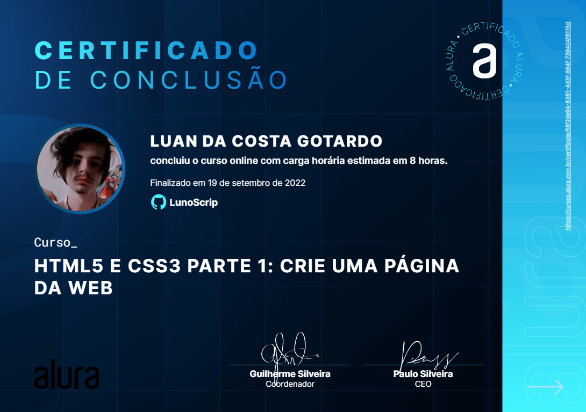

# Projeto Expecialista Front-End
Aqui sera postados todos os meus certificados

# cursos
* JavaScript: tipos, variáveis e funções
* Http: Entendendo a web por baixo dos panos
* Php: Composer dependências, autoload e publicação

Arquivo | Curso | Url De Comprovação 
--- | --- | --- 
Luan Da Costa Gotardo - Curso JavaScript tipos, variáveis e funções | JavaScript: tipos, variáveis e funções | https://cursos.alura.com.br/certificate/c53c3eca-e374-4dc9-a2ff-519c672eb737 
Luan Da Costa Gotardo - Curso HTTP ENTENDENDO A WEB POR BAIXO DOS PANOS | HTTP: ENTENDENDO A WEB POR BAIXO DOS PANOS | https://cursos.alura.com.br/certificate/987408cf-ca6d-471a-b45c-088dfe123b77 
Luan Da Costa Gotardo - Curso PHP COMPOSER DEPENDÊNCIAS, AUTOLOAD E PUBLICAÇÃO - Alura.pdf|PHP COMPOSER DEPENDÊNCIAS, AUTOLOAD E PUBLICAÇÃO |https://cursos.alura.com.br/certificate/cd539893-f27e-47b0-ae6e-01aa43662938
Luan Da Costa Gotardo - Curso HTML5 e CSS3 parte 1: crie uma página da Web COMPOSER DEPENDÊNCIAS, AUTOLOAD E PUBLICAÇÃO |https://cursos.alura.com.br/certificate/58f2de94-8361-4d3f-884f-739404f8115d

